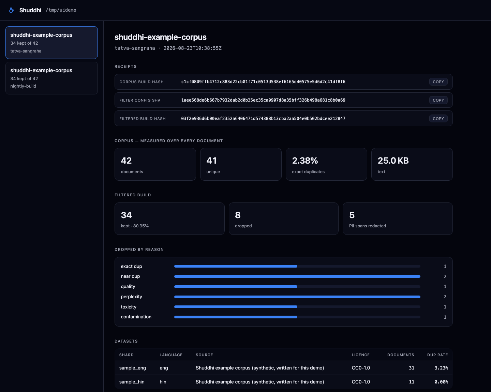

<picture>
  <source media="(prefers-color-scheme: dark)" srcset="docs/img/brand/shuddhi-horizontal-dark.svg">
  
</picture>

# Shuddhi (शुद्धि) — Data Factory

**A receipts-first data factory for sovereign AI.** Shuddhi turns raw text
into a filtered corpus *with a verifiable identity*: every document is
content-hashed, every shard carries provenance, every filter threshold is
pinned, and the whole build collapses into one hash that a training run
cites in its ledger.

Six months after a training run, "which documents did this model see, and
can you prove the customer data was excluded?" should have an answer that
does not depend on anyone's memory. That is what this produces.

Internally the engine is the **Tatva Data Factory**; Shuddhi is the product.

[](https://github.com/agentanywhere/shuddhi/actions/workflows/ci.yml)
[](LICENSE)
[](pyproject.toml)

Apache-2.0. CPU-only. No network calls, no telemetry, no account.

---

## Try it in one minute

```bash
docker build -t shuddhi .
docker run --rm shuddhi demo
```

That runs the complete pipeline over a bundled sample corpus with
deliberately planted defects, so every filter visibly catches something:

```
kept 34 of 42 documents; 5 PII spans redacted
dropped by reason: {'exact_dup': 1, 'near_dup': 2, 'quality': 1,
                    'perplexity': 2, 'toxicity': 1, 'contamination': 1, 'pii': 0}
refused at the gate: ['customer_export']
```

Run it twice: the hashes do not change. Run it on macOS, in a venv, and in
the container: the hashes still do not change.

No Docker? `make venv` or `make conda`, then `./scripts/demo.sh`.

---

## See your builds

```bash
shuddhi ui --dir shuddhi-out/
```



Build history, the datasets that went in, live progress while a run is
happening, every warning and error, and the receipt to download. It reads
your output directory and serves to localhost — no accounts, no database, no
telemetry, and it works air-gapped because there is no CDN to reach.


## Documentation

| | |
|---|---|
| **[Quickstart](docs/QUICKSTART.md)** | install, see it work, run it on your own corpus |
| **[User Guide](docs/USER-GUIDE.md)** | every stage, what it measures, how to tune it |
| **[CLI Reference](docs/CLI-REFERENCE.md)** | every command, flag, and exit code |
| **[Docker](docs/DOCKER.md)** | mounts, compose, CI usage |
| **[Troubleshooting](docs/TROUBLESHOOTING.md)** | when something goes wrong |
| **[FAQ](docs/FAQ.md)** | how it differs from other curation pipelines, and what it does not do |
| **[Extending](docs/EXTENDING.md)** | write a filter plugin; how custom filters stay inside the receipt |
| [Engine internals](docs/ENGINE-INTERNALS.md) | stage-by-stage implementation notes |
| [Measured report](docs/MEASURED-REPORT.md) | the full 176 GB run, with coverage on every number |

---

## The receipts chain

```
registry              source · licence · date · data_class, per shard
   │                  (customer-class data refused here, in code, no override)
   ├─► corpus_build_hash     content hash of the accepted document set
   ├─► filter_config_sha     every threshold + droplist + lexicon shas
   └─► filtered_build_hash   chained to both — the string training cites
```

Order-independent, recomputable by anyone holding the shards, and unchanged
by parallelism. No signature to trust, no server to ask.

---

## Who this is for

- **Anyone training or fine-tuning on data they will have to account for** —
  because a customer, a regulator, an acquirer or a court eventually asks what
  the model learned from, and "we were careful" is not an answer.
- **Regulated industries** — banking, insurance, defence, healthcare — where
  excluding customer data must be demonstrable rather than asserted.
- **Sovereign and public-money AI programmes** that owe the public an account
  of their training data.
- **Providers of general-purpose models placed on the EU market**, who owe the
  AI Office an Article 53(1)(d) summary.
- **Teams working in Indic languages** — the language ID, script handling and
  tokenizer tooling were built for 15 Indian languages, not retrofitted onto
  an English pipeline.
- **Researchers** who need benchmark-contamination screening they can point at.

If you are cleaning a scratch dataset nobody will ever audit, you do not need
this — reach for a curation pipeline and move on.

---

## For the EU AI Act

Article 53(1)(d) of Regulation (EU) 2024/1689 requires every provider placing a
general-purpose AI model on the Union market to publish a "sufficiently detailed
summary of the content used for training", on the template the AI Office
published on 2025-07-24. Enforcement powers activated 2026-08-02; models placed
on the market before 2025-08-02 must publish by 2027-08-02.

```bash
shuddhi report --eu-ai-act --registry examples/registry.json \
                         --manifest BUILD-MANIFEST.json > article-53.md
```

Shuddhi does not compute anything new for this. `source`, `licence`,
`data_class`, `language` and `date_acquired` are already **required** registry
fields — a shard missing any of them is refused, not defaulted — so the summary
is a projection of what admission already recorded.

Pass the `BUILD-MANIFEST.json` that `shuddhi build` writes, not the corpus
`MANIFEST.json` that `shuddhi run` writes: only the first records a filter
pass. Hand it the wrong one and it says so and marks the fields a **GAP**,
rather than reporting a retention count nothing measured.

**It does not make you compliant, and it never claims to.** Compliance is a legal
position held by a provider, not a property of a tool. What you get is a draft
grounded in what was actually recorded, for your counsel to complete. Every field
a corpus cannot know — provider identity, crawler identity, your TDM opt-out
policy under Directive (EU) 2019/790 Art. 4(3) — is printed as an explicit
**GAP** rather than guessed or quietly omitted. An incomplete summary you can see
beats a confident one that is wrong.

One answer in it is stronger than most providers can give. Where the template
asks how user data was handled, the honest answer here is that a build containing
it **cannot be produced** — the refusal is structural, not procedural.

---

## Already using NeMo Curator, DataTrove, or Dolma?

Keep using them. They are good at throughput, and out-curating NVIDIA's GPU dedup
is a fight that helps nobody. What none of them emits is a *receipt* — an artefact
you can hand a regulator, an auditor or a customer that says "this, exactly this,
is what the model saw."

```bash
shuddhi attest --corpus ./out-from-datatrove/ --corpus-id fineweb-slice
```

The fingerprint uses the **same hash definition** a native build uses, so an
attested corpus and a Shuddhi-built one are verifiable the same way and
comparable to each other. If the producing tool left a manifest, it is *cited,
never verified* — we did not observe that run.

|                          | Shuddhi | Curation pipelines |
|---|---|---|
| Primary output           | a corpus **and a receipt** | a corpus |
| Corpus identity          | reproducible content-addressed hash | filenames and a README |
| Filter settings          | pinned into the corpus's identity | recorded by convention, if at all |
| Data-policy enforcement  | refused in code, no override | policy documents and review |
| Regulatory output        | Article 53(1)(d) summary from the manifest | — |
| Custom filters           | plugin API; identity enters the receipt | usually fork or patch |
| Throughput               | CPU-first, one machine to a few dozen cores | higher, often GPU/cluster |
| Setup                    | `docker run`; no account, no telemetry | varies |

Read it this way: they are optimised for **getting a corpus clean**, Shuddhi for
**being able to prove what a corpus is**. The two compose — clean with theirs,
attest with this.

An attestation proves **content, not acquisition**. It binds a corpus to a hash
and reports what is inside it; it cannot establish where the data came from or
under what licence. Without `--registry`, every provenance field reads `UNKNOWN`
rather than blank — because a blank reads as "nothing to declare", which is the
dangerous misreading.

---

## What it does

| stage | module |
|---|---|
| Provenance gate — customer-class data refused before the file is opened | `registry.py` |
| Streaming ingest, document hashing, shard SHA-256 | `shards.py` |
| Exact dedup (full corpus) | `dedup.py` |
| Near-dup — MinHash/LSH, disk-backed, order-independent exemplar | `neardup.py` |
| Language ID — fastText lid.176, Unicode-script fallback | `lid.py` |
| Quality heuristics | `quality.py` |
| Perplexity proxy — per-language char-trigram LM | `ngram_lm.py` |
| Toxicity — lexicon tier, pluggable and sha-pinned | `toxicity.py` |
| PII — scan and redact (email/phone/Aadhaar/PAN/Luhn cards/IP) | `pii.py` |
| Domain classification | `domain.py` |
| Contamination screen against your eval sets | `contamination.py` |
| Applied-filter builds with chained hashes | `builder.py` |
| HTML → shard extraction | `extract.py` |
| Tokenizer train/eval lab | `tokenizer_lab.py` |
| Attest a corpus **another tool** built — same hash definition, honest about limits | `attest.py` |
| EU AI Act Article 53(1)(d) training-content summary, as a reviewable draft | `eu_ai_act.py` |
| **Filter plugin API** — third-party/commercial filters, no fork, identity in the receipt | `plugins.py` |

CPU-only throughout. No GPU, no cluster, no network calls.

---

## Proven at scale

From the reference run — 176.1 GB, 33,047,370 documents, 15 languages, on a
single 2-vCPU box:

| | |
|---|---|
| corpus build hash | `5e8fbb96…`, reproduced across **four** independent full passes |
| filtered build hash | `a532e4ed…` — 32,289,800 documents kept (97.71%) |
| dropped | 0.38% exact-dup · 0.83% near-dup · 1.05% perplexity · 0.02% quality · 0.016% toxicity |
| contamination | 0, verified on **every** document |
| PII | 182,781 spans redacted |
| largest near-dup cluster | one template repeated 84,275 times |

Full detail, with coverage labelled on every number, in the
[measured report](docs/MEASURED-REPORT.md). Claims discipline is part of the
product: full-pass, sampled, and derived figures are never mixed silently,
and the report states what was *not* measured.

---

## Development

```bash
make help          # every task
make doctor        # can this interpreter run the pipeline?
make test          # 140 tests, no network, seconds
make demo          # end-to-end on the sample corpus
make docker-demo   # the same, inside the container
```

Repo layout:

```
shuddhi            CLI: doctor · check · run · merge · build · build-union
                           attest · report · plugins · neardup-sig
                           neardup-merge · train-lm · extract
*.py                  the stages (table above)
tests/                140 tests, tiny fixtures
examples/             sample corpus with planted defects, registry, lexicon
scripts/demo.sh       the end-to-end demo
configs/              shard registries
runs/                 measured manifests from the reference corpus
docs/                 the documentation set
```

---

## Contributing

Issues and pull requests are welcome — see [CONTRIBUTING.md](CONTRIBUTING.md)
for the ground rules (the important one: anything that changes what a build
keeps must also change the build's identity). Security-sensitive reports go
to security@shephertz.com per [SECURITY.md](SECURITY.md).

Most new filters belong in a [plugin](docs/EXTENDING.md) rather than in core.

## Permanently open

The engine, **every** built-in filter, local receipt generation and the
customer-data refusal are Apache-2.0 and will not move behind a proprietary
licence later. Commercial offerings extend Shuddhi through the public plugin API
and through hosted services — they do not remove capability from the open engine,
and an existing open feature will not be repackaged as a paid one.

We are stating this because the alternative is well documented: several
open-core projects relicensed after adoption, and what they lost was not revenue
but the willingness of anyone to build on them again.

| | Open source (Apache-2.0) | Commercial |
|---|---|---|
| Engine, CLI, every built-in filter | ✅ | |
| Provenance gate + customer-data refusal | ✅ | |
| Receipt generation **and verification** | ✅ forever | |
| Dedup, quality, perplexity, toxicity, PII, contamination | ✅ | |
| Applied builds, partition builds, chained hashes | ✅ | |
| Attesting corpora from other tools | ✅ | |
| Article 53(1)(d) summary generation | ✅ | |
| Plugin API | ✅ | |
| Docker, docs, community issues | ✅ | |
| Hosted registry — signed org-wide ledger, model→corpus→licence lookup, retention, legal hold, SSO/RBAC | | ✅ |
| Team workflow — review queues, approvals, sign-off | | ✅ |
| Compliance packs — NER-class PII, classifier-tier toxicity, sector rule packs | | ✅ |
| Cross-build analytics, corpus drift, filter-yield comparison | | ✅ |
| Multi-node scale-out, incremental and resumable builds | | ✅ |
| SLA, air-gapped deployment, named support | | ✅ |

Commercial filters ship through the **same public plugin API** anyone else uses,
and a paid filter still cannot change a corpus without changing that corpus's
receipt.

What is commercial: a hosted registry with signed attestation, team review
workflow, cross-build analytics, air-gapped deployment and support. The engine
demands a named human reviewer for a suspect shard and gives you no way to manage
that queue — managing it is the product. **The engine and the proof are free;
running it as an organisation is paid.**

The discipline that keeps this honest: if a commercial feature needs an engine
change, that engine change is made here, in the open repository.

## Use it in CI

The provenance gate is designed to be a merge gate — `check` exits non-zero
when any shard is untagged or carries a customer data class, so an unreviewed
dataset cannot land:

```bash
docker run --rm -v "$PWD:/work" ghcr.io/agentanywhere/shuddhi:1.2.0 \
    check --registry /work/registry.json
```

Copy-paste configurations for GitHub Actions, GitLab CI, Azure Pipelines,
Bitbucket Pipelines, CircleCI and Jenkins are in [`ci/`](ci/) — each gates
pull requests and publishes the receipt as a build artefact.

## Contact

- **Bugs, questions, feature requests** — open a
  [GitHub issue](https://github.com/agentanywhere/shuddhi/issues).
- **Security and receipt-integrity reports** — privately, see
  [SECURITY.md](SECURITY.md).
- **Commercial, design partnership, deployment help** —
  [sales@shephertz.com](mailto:sales@shephertz.com) or
  [agentanywhere.ai/shuddhi](https://agentanywhere.ai/shuddhi).

We are actively looking for design partners for the hosted registry. If you
have a corpus you have to account for, we would like to hear about it.

## Licence

Apache-2.0 — see [LICENSE](LICENSE) and [NOTICE](NOTICE). "Shuddhi" is a
trademark of ShepHertz Technologies; the licence covers the software, not
the name.
